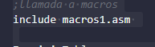
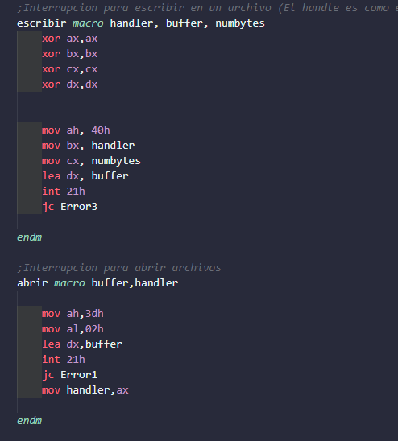
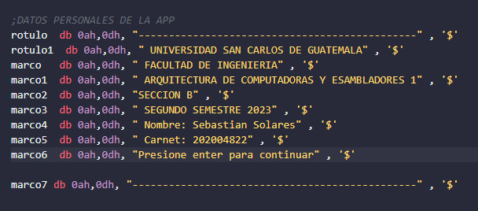
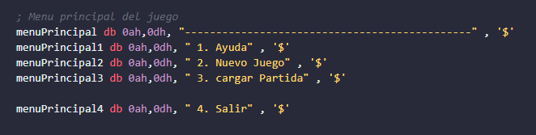
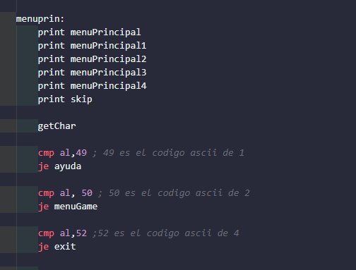
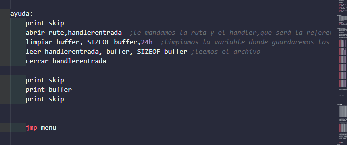
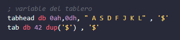
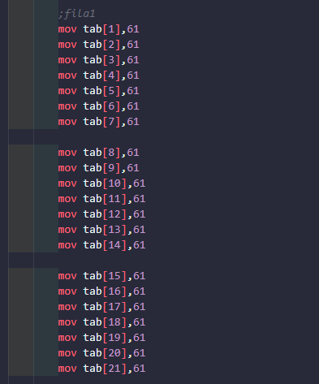
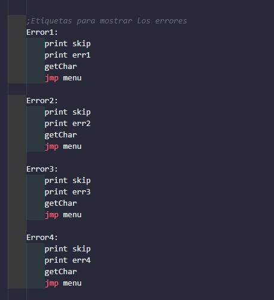

#Manual tecnico
##Macros
este es un archivo que contiene varias funciones que nos facilita la creacion de muchas cosas, como abrir archivos, leerlos, escribir en el, imprimir informacion en pantalla etc.

##Carteles
para poder imprimir cosas en pantalla primero se debe crear la variable y luego llenar con la informacion deseada

Para la creacion del programa se creo un menu principal en el cual contiene 4 opciones

Se imprimen los carteles y depende la opcion que se va elegir se diirige a esa funcion

##Ayuda

##Nuevo juego
Se crearon 2 variables una para mostrar el encabezado y la otra que es un array de 42 posiciones matriz 7x6

Luego se llenaron cada posicion con un signo = que en codigo ascii es el 61

##Errores
Estos carteles nos serviran para imprimir algun error en pantalla que haya pasado durante la ejecucion del programa
