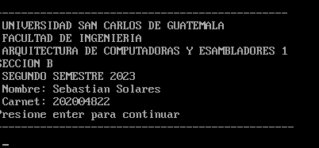
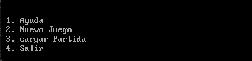
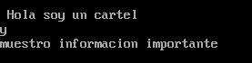
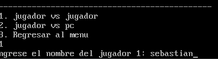
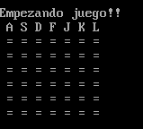

#Manual de usuario 
Al iniciar el programa muestra los datos del estudiante, al presionar enter dirijira al menu principal

El menu principal cuenta con varias opciones una de ellas es para iniciar un nuevo juego, cargar partidas etc.

##Ayuda
al presionar el numero 1 este opcion leera un archivo .txt y mostrara en pantalla la informacion que contenga este archivo al presionar la letra "q" funciona para salir al menu principal y la letra "n" para mostrar el siguiente conjunto de lineas

##Nuevo juego
al presionar esta opcion el usurio podra elegir si jugar con una maquina o con otro jugador, si se presiona para jugar contra otro jugador este pedira el nombre de cada uno.

##Cargar partida
esta opcion cargara la partida que anterior mente se haya guardado

##Salir
al elegir esta opcion el programa se detendra.
